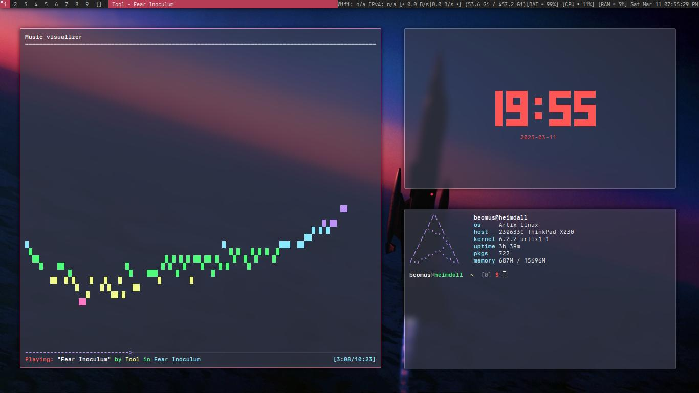

# dwm

dwm is an extremely fast, small, and dynamic window manager for X. 
This particular fork of dwm, is an adaptation of my normal dwm fork, but specifically configured for the Lenovo ThinkPad X230.


## Configuring dwm

The configuration of dwm is done by editing either config.h/config.def.h
and (re)compiling the source code. It is good practice to back up your working build of dwm and apply patches/modifications to a copy before merging the two.
Also, modifying ```config.def.h``` instead of ```config.h``` is encouraged, as well as removing the generated ```config.h``` file before recompiling, as leaving it will cause dwm to use the leftover config.h from the last update, instead of generating a new one and applying the new patches. But i'm not your dad, so you can do what you want.

## Beomus's build

Just clone this repo and compile with the following command:
```
  $ make clean install
 ```
dwm should put it's binary in ```/usr/local/bin``` by default, but if it doesn't work, you can run that command as root too, it's what i do.
Also, a lot of the commands used in my keyboard shortcuts, such as the scrot command i use to take a screenshot uses my user directory:
```
$ scrot /home/beomus/Pictures/Screenshots/%Y-%m-%d-%T-screenshot.jpg
```
As you would probably imagine, this will cause some problems if you don't change it to your username. Something I need to do is have dwm automatically pull the username, write it to a variable, and use that as the username in these commands. Or just use ~/ .  But (famous last words) this will work for now.


## Patching in more features 

You can find a treasure trove of excellent patches for dwm over at https://dwm.suckless.org/patches/
Credit for those patches goes to their respective authors.
I did not write any of the patches used in this fork. (Shit's complicated, and i'm not a C wizard like the suckless devs or the Stanford/MIT gods.) But I intend to contribute when I have the skill and the time to.


## Custom Shortcuts

```
Super + Enter		|	Open Kitty terminal
Super + l		|	Lock display with xsecurelock
Super + Shift + t		|	Open my timetable 
Super + b		| 	Open Librewolf Browser
Super + p		| 	Open Volume Control with pulsemixer
Super + m		| 	Open email with thunderbird
Super + Shift + s	| 	Take a screenshot with Scrot
Super + Shift + Equals	| 	Brightness up with Light 
Super + Shift + Minus	| 	Brightness down with Light 
```
## Note on brightness control
 
 Depending on your distro, you may need to add your user to a group that gives you write permissions for the files that control screen brightness. Or you can do what i did at first, and just chmod the file like an actual smoothbrain. (do not do that, you might give all users permission to change your screen brightness, which is not an intelligent decision...)

## Dependencies

There are a few 3rd party programs that i've integrated into this fork.

They are included but not limited to: \
```kitty``` As default terminal \
```xsecurelock``` For screen locking \
```light``` For backlight control \
```scrot``` As screenshot tool \
```picom``` As the compositor
```neomutt``` As default email client
```librewolf``` As default browser 

You can install these packages with the appropriate command for your distro.

Arch
```
$ pacman -S xsecurelock light kitty scrot picom neomutt
```

Debian/Ubuntu
```
$ apt-get install xsecurelock light kitty scrot picom neomutt
```

Fedora/RHEL/CentOS
```
$ dnf intall xsecurelock light kitty scrot picom neomutt
```
Void
```
$ xbps-install xsecurelock light kitty scrot picom neomutt
```

###### NOTE:
- Librewolf may need to be installed manually for your particular distro. See their website for more details. For arch users, librewolf is available in the AUR as both a binary, and source package.
- My version of neomutt has been set up with [Luke Smith's neomutt setup scripts.](https://github.com/LukeSmithxyz/mutt-wizard)
